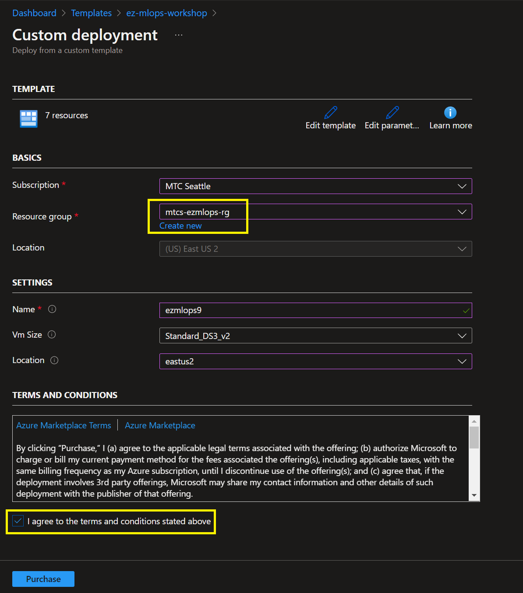
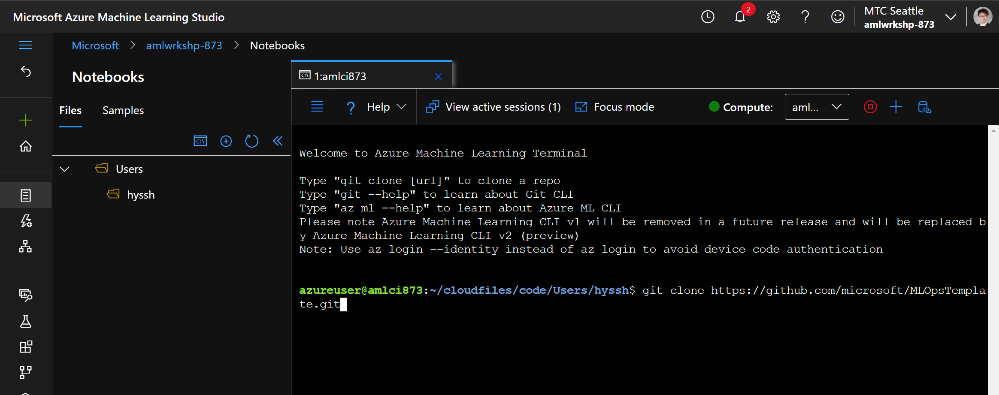
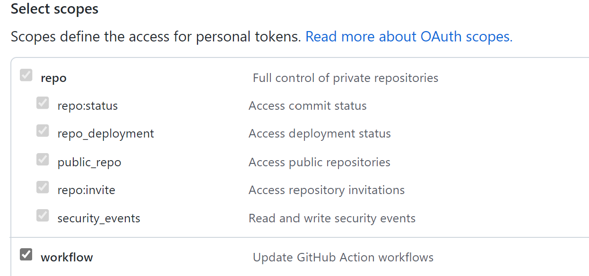
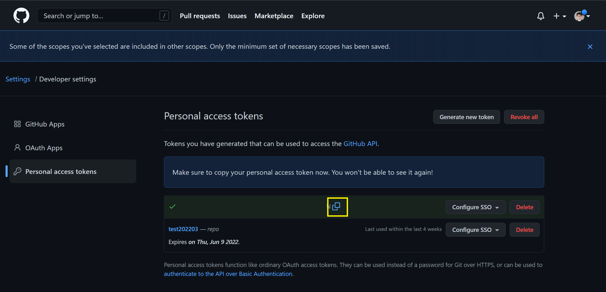
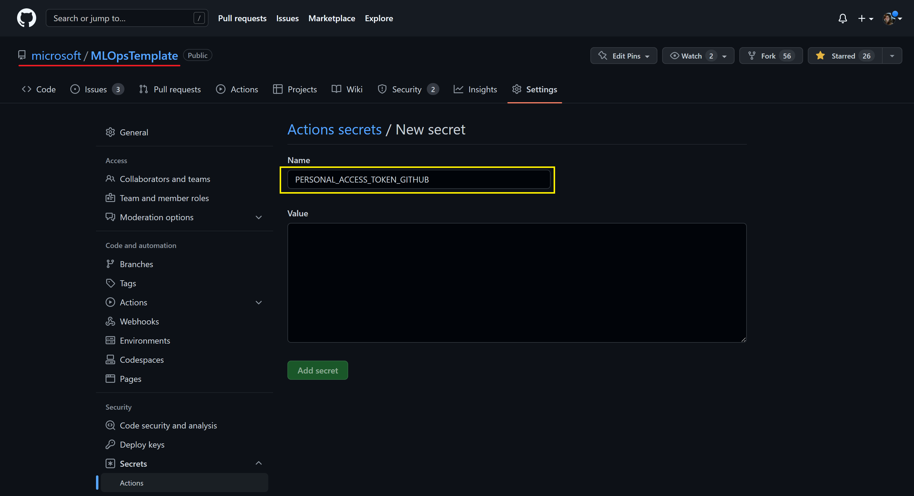
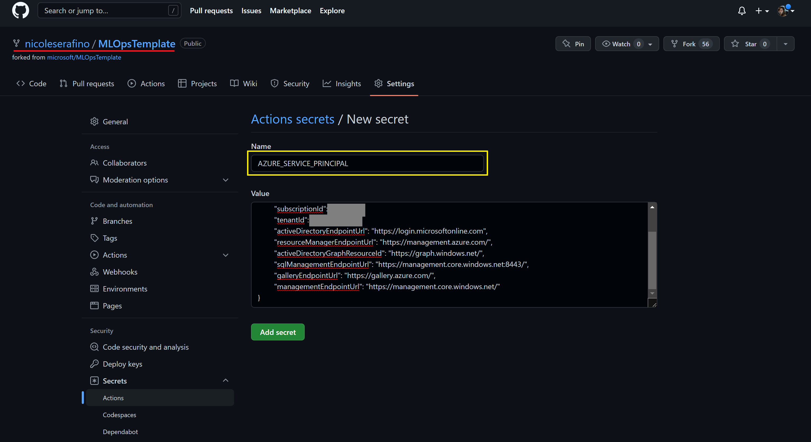

# Part 0: Workshop Environment Setup
> Note: Read the Workshop scenario overview [here](https://github.com/microsoft/MLOpsTemplate/blob/main/src/workshop/README.md#workshop-scenario)

## Goal
- Setup Azure ML workspace and components
- Setup github account, a personal access token and configure settings
- Setup local python development environment
- Generate and register data for the workshop
- Setup SP (Service Principal)

## Pre-requisites for part 0
- An Azure Account and Subscription
- An understanding of:
    - Azure Subscriptions and Resource Groups
    - Service Principals
    - Github mechanics (creating an account, forking a repo, etc.)

## Steps

0. [Check list](./part_tips.md)

1. [Create Azure Machine Learning resources in Azure](#1-Create-resources-in-Azure)

2. [Setup Github account and settings](#2-Setup-github-account-and-settings)

3. [Setup your development environment](#3-Choose-your-development-environment)
    - Option A: Use CI as your local in AML
    - Option B: Use your local machine (PC or MAC)

4. [Configure secret in your Github account](#4-Configure-secret-in-your-Github-account)
    - Create a Personal Accesss Token (PAT)
    - Add a Service Principal (SP) to your repo in Github

> Note: For a detailed video walk-through of the process, click on the video below to walk through Steps 0 to 3.
> [](https://youtu.be/k9ExpebwR18)


## 1. Create resources in Azure
>Note: To create resources you need at least 1 Resource Group `Owner` role or `Contributor` role. If you don't have either one of these roles, you cannot create any of the following resources.

- 1.1 Open following link in new tab

    [](https://portal.azure.com/#create/Microsoft.Template/uri/https%3A%2F%2Fraw.githubusercontent.com%2Fmicrosoft%2FMLOpsTemplate%2Fmain%2Fsrc%2Fworkshop%2Fdocuments%2FIaC%2Fiac_EZ_MLOps.json)

- You can create new Resource Group if you have contributor role of the subscription. Or you can use existing Resource Group by choosing it.

- Fill out the rest and click `Create` button at the bottom

    

- The provisiononig will take 4 mins to 5 mins

    - If you want to see the progress of the provisioning, you can clikc 'Notification' icon 

    

> IMPORTANT: If this script failed, you can't do following labs.
>
> Please contact your CSA or lab instructor with the error message.

- When the provisioning is done you can leave it, open new tab in your browser for next step

Leave the tab open, don't close it yet

## 2. Setup github account and settings

- From the new brwoser tab, go to [Github](https://github.com/) and login

> If you don't have an account for Github, please sign up
>
> The workshop can't be done without the Github account

- After the login, go to [https://github.com/microsoft/MLOpsTemplate](https://github.com/microsoft/MLOpsTemplate) and click __fork__

    

- You will have the same repo in you github account Repository

- Leave the tab open, DO NOT close it yet, you will come back to the your repo

## 3. Choose your development environment

In this step you will clone your repo into your local development environment. The local can be Compute Instance in AML or your laptop. There are two options to setup local development environment. Choose an option.

    - Option A. Use CI in AML
    - Option B. Use Your laptop(PC/MAC)

### Option A. Use Compute Instance in AML

- Go to [Azure Machine Learning Studio](https://ml.azure.com)

- Go to __Compute__ > __Compute Instance__

- Click new __Terminal link__

- Clone __your__ 'MLOpsTemplate' repo in the Terminal of Compute Instance

    - Make sure you have forked the repo to your repository
    
    - Before you run following command, upate _{YOURGITHUBACCOUNT}_ part

    - Run following commnad to clone

```bash
git clone https://github.com/{YOURGITHUBACCOUNT}/MLOpsTemplate.git
```

> Note: Make sure you're running the command from the path like following. This is path in your Compute Instance
> `~/cloudfiles/code/Users/YOURALIAS$`



- Generate and register data for the workshop

    - Update arguments "_NAMES_ and _ID_" accordingly and then run following commands from the Terminal

        ```bash
        cd ./MLOpsTemplate/src/workshop
        conda env create -f conda-local.yml
        conda activate mlops-workshop-local
        python ./data/create_datasets.py --datastore_name workspaceblobstore --ml_workspace_name "AML_WS_NAME" --sub_id "SUBSCRIPTION_ID" --resourcegroup_name "RG_NAME"
        ```
        
> Note: You can find the __Resource Group Name, Azure Machine Learning Name__ and the __Location__ from Azure portal.
>
> 

- Install az ml CLI v2

    - Run following command to see az extension

        ```bash 
        az extension list
        ```

        - If you see azure-cli-ml extension, remove it by running following command. 

            ```bash 
            az extension remove -n azure-cli-ml
            ```
        - If you see ml extension, remove it by running following command.

            ```bash 
            az extension remove -n ml
            ```
        
    - Install az ml CLI v2

        ```bash 
        az extension add -n ml -y --version 2.2.1
        ```

- Setup az cli
    - Run the following command from the Terminal

        ```bash
        az login
        ```

    - You need to loging to be authenticated to use az cli
        
        After copy the __code__ and go to the link, [https://microsoft.com/devicelogin](https://microsoft.com/devicelogin). 
        
        Use the code and follow the instruction to finish the login.

- Configure subscription and Azure Machine Learning Workspace

    ```bash
    az account set -s "<YOUR_SUBSCRIPTION_NAME>"
    az configure --defaults group="<YOUR_RG_NAME>" workspace="<YOUR_AML_NAME>" location="<YOUR_REGION_NAME>"
    az configure -l -o table
    ```
    
    > Note: You can find the __Resource Group Name__, __Azure Machine Learning Name__ and __the Location__ from the user profile in the AML Studio.
    >
    > 

- The results will look like following

    

- Create Service Principal

    > If you have SP (Service Principal) or know that your team/org has the one,
    >> Get the detail information
    >> - clientId (aka YOUR_APP_ID)
    >> - clientSecret
    >> Ignore this step and go to next step 4.
    > 
    > If you don't have the SP, please follow this step.
    >> In case you don't have permission to create SP, please reach out to your Azure infra/security team to get help
    
    - Get following information

        - Your Azure SubscriptionID where your Azure Machine Learning service is 
        - Resource Group Name where your Azure Machine Learning service is 
        - (Random) Name for the Service Principal you're about to create

    - Update Run following command from the terminal

    ```bash
    az ad sp create-for-rbac --name {REPLACE_SPNAME} --role contributor --scopes /subscriptions/{REPLACE_SUBSCRIPTIONID}/resourceGroups/{REPLACE_RESOURCEGROUPNAME}
    ```
    
    

    - Important: Make sure you take a note of `"appId", "displayName", "password", "tenant"` from the output

- Leave the terminal open, don't terminate it yet

### Option B. Use your laptop (PC/MAC)

> If you followed Option A, you don't need this Option B.

- Create local python development environment

    - [Install Conda](https://docs.conda.io/projects/conda/en/latest/user-guide/install/index.html), [git](https://git-scm.com/downloads?msclkid=1f5aa675b42811ecb1979c5fb8e69812) and your prefered IDE, for example, [VS Code](https://code.visualstudio.com/Download?msclkid=32cd8937b42811ec9681883c942b2912)

        - Use VSCode and VSCode for python if possible

- Open your local terminal

- [Install az CLI](https://docs.microsoft.com/en-us/cli/azure/install-azure-cli#install)

- Install az ml CLI v2

    - Run following commands from your local terminal
    
    - Check az extension by running following command

        ```bash 
        az extension list
        ```

        - If you see azure-cli-ml extension, remove it by running following commnad. If you dont see, then move to next step

            ```bash 
            az extension remove -n azure-cli-ml
            ```
        
    - If you don't see ml 2.#.# form the extension list, install az ml CLI v2

        ```bash 
        az extension add -n ml -y --version 2.2.1
        ```

- Setup az cli

    - Run follwoing command from the Termianl

        ```bash
        az login
        ```

    - You need follow the guide to use az cli for the lab

        

        After copy the __code__ from the terminal, open a new tab, go to the link, [https://microsoft.com/devicelogin](https://microsoft.com/devicelogin).
        
        Use the code and follow the instructions to finish the login.

- After the log in, come back to your terminal

- Configure subscription and Azure Machine Learning Workspace by running next commands

    ```bash
    az account set -s "<YOUR_SUBSCRIPTION_NAME>"
    az configure --defaults group="<YOUR_RG_NAME>" workspace="<YOUR_AML_NAME>" location="<YOUR_REGION_NAME>"
    az configure -l -o table
    ```
    
> Note: You can find the __Resource Group Name, Azure Machine Learning Name__ and __the Location__ from the user profile in the AML Studio.
>
> 

- The results will look like following
  
    

- Continue next guide from your local terminal

- Clone your 'MLOpsTemplate' repo

    - Before you run following command, upate __{YOURGITHUBACCOUNT}__ part

    - Sample command looks like following

    ```bash
    git clone https://github.com/{YOURGITHUBACCOUNT}/MLOpsTemplate.git
    ```

    - Using conda, create a new virtual environment or use an existing virtual environment with azureml-sdk, pandas, sckit-learn

        - If you don't have an existing conda virtual environment, use following command to create new

            ```bash
            cd ./MLOpsTemplate/src/workshop
            conda env create -f conda-local.yml
            ```

- Generate and register data for the workshop

    - Update arguments __"NAMES and ID"__ accordingly and then run following commands from your local terminal

        > You should run the commands from the paht, __'MLOpsTemplate/src/workshop$'__

        ```bash
        conda activate mlops-workshop-local
        python ./data/create_datasets.py --datastore_name workspaceblobstore --ml_workspace_name "AML_WS_NAME" --sub_id "SUBSCRIPTION_ID" --resourcegroup_name "RG_NAME"
        ```

- Create Service Principal

    > If you have Service Principal, please use the existing one. Ignore this step and go to next step 4.
    > 
    > If you don't have the Service Principal, please follow this step.
        
    - Get following information

        - Your Azure SubscriptionID
        - Resource Group Name

    - Update Run following command from the terminal

    ```bash
    az ad sp create-for-rbac --name {REPLACE_SPNAME} --role contributor --scopes /subscriptions/{REPLACE_SUBSCRIPTIONID}/resourceGroups/{REPLACE_RESOURCEGROUPNAME}
    ```

    

    - Important: Make sure you take a note of `"appId", "displayName", "password", "tenant"` from the output

- Leave the terminal open, don't terminate it yet


## 4. Configure secret in your Github account

There are the last two tasks you need to do

    4.1 Create PAT (Personal Access Token)
    4.2 Add SP to your repo in Github


### 4.1 Create PAT (Personal Access Token)

You are going to create PAT to allow your code access your personal git repo

- To make PAT, you need to go to Settings of your account, NOT repo setting

    

- From the setting, find and __click__ '_<> Developer settings_' menu at the bottom left conner of your screen

    

- __Click__ '_Personal access token_' and __click__ '_Generate new token_'

    

- Check for '_repo_' for the scope and then __click__ '_create_' at the bottom of your screen

    

- You'll see the token. Make sure you copy and keep it safe. 

    

- Now you're going to add the token to your repo

- Go back to your 'MLOpsTemplate' repo where your forked from microsoft/MLOpsTemplate

    - The url of your repo will looks like this

        ```text
        https://github.com/{YOURACCOUNT}}/MLOpsTemplate
        ```

- From your repo __click__ '_Setting_'

    

- Find a menu '_Secrets_' on the left side of menu, and __click__ 'Actions'. After that __Click__ 'New repository secret'

    

- Type `USER_NAME_GITHUB_SECRET` for the name of the secret, and paste the token you copied from PAT section

    > Important: The name for this secret must be `USER_NAME_GITHUB_SECRET`

    


### 4.2 Add SP to your repo in Github

From this section, you'll add SP information to your repo. The SP information will be used during the Github Actions

- Before you create another secret, please __update__ folling jason and __copy__ (Ctrl+C)


```json
{
	"clientId": "YOUR_APP_ID",
	"clientSecret": "YOUR_CLIENT_SECRET",
	"subscriptionId": "SUB_ID",
	"tenantId": "TENANT_ID",
	"activeDirectoryEndpointUrl": "https://login.microsoftonline.com",
	"resourceManagerEndpointUrl": "https://management.azure.com/",
	"activeDirectoryGraphResourceId": "https://graph.windows.net/",
	"sqlManagementEndpointUrl": "https://management.core.windows.net:8443/",
	"galleryEndpointUrl": "https://gallery.azure.com/",
	"managementEndpointUrl": "https://management.core.windows.net/"
}
```

- Go back to your 'MLOpsTemplate' repo where your forked from microsoft/MLOpsTemplate

    - The url of your repo will looks like this

        ```text
        https://github.com/{YOURACCOUNT}}/MLOpsTemplate
        ```

- From your repo __click__ '_Setting_'

    

- Find a menu '_Secrets_' on the left side of menu, and __click__ 'Actions'. After that __Click__ 'New repository secret'

    

- Type `AZURE_CREDENTIALS_USERNAME` for the name of the secret, and paste

    > Important: The name for this secret must be `AZURE_CREDENTIALS_USERNAME`

    


## [Go to Part 1](part_1.md)
