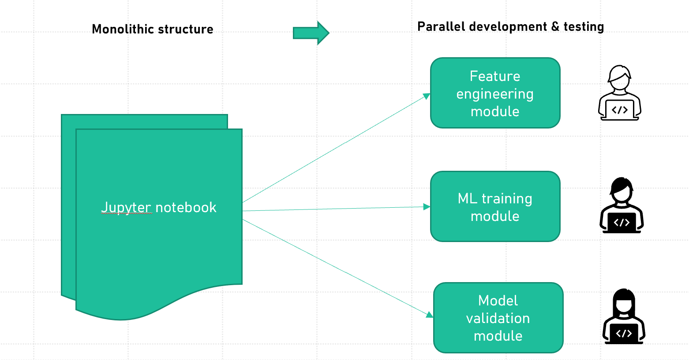

# Part 1: Structure code for fast iterative development

## Goal 
Your team has been working on a new ML problem. The team has been performing exploratory work on data and algorithm and has come to a state that the solution direction is solidified. Now, it is a time to put a structure into the work so that the team can iterate faster toward building a fully functional solution.   

So far, team members have been working mostly on Jupyter notebooks on their personal compute (Azure CI & PC). As the first step in MLOps, you need to re-engineer the process so that the team can accompblish the followings:  

- Modularization: monolithic notebook is refactored into python modules that can be developed and tested independently and in parallel by multiple members 
- Parameterization: The modules are parameterized so that they be rerun with different parameter values.

 
## Pre-requisites
- Complete [Part 0](part_0.md) to setup Azure ML workspace and development environment.
- Run [create_datasets.py](part_0.md#option-a-use-compute-instance-for-code-development) to create local datasets for unit testing and full dataset in cloud for full running.

## Tasks

> Note: You can run following tasks on Compute Instance in your Azure Machine Learning. You can use __Jupyter__ or __VSCode__.

- Review the [jupyter notebook](../notebooks/taxi-tutorial.ipynb) that represents the work of a data scientist up to this point, make sure you can run the notebook and understand it.
- Discuss in your team why a monolithic code structure is a challenge to scalable and a repeatable ML development? 
- Now observe how the monolithic notebook was refactored into a feature/data engineering module, a ML training module and a model validation module so that they can be developed and run independently
- Detailed instructions:
    - Review the solution  (files without my_ prefix) under ```data_engineering```, ```training``` and   ```evaluating``` folders
    - Review the ```workshop/data``` folder: there are data files that were created by the data generation process. The same data files were also sent to your remote AML datastore 
    - Review the refactored engineering logic from the notebook at ```my_feature_engineering.py``` module under ```data_engineering``` folder. 
        - The module performs the followings:
            - Accept following parameters
                - ```input_folder```: path to a folder for input data. The value for local test run is ```data```
                - ```prep_data```: path to a folder for output data. The value for local test run is ```data```
                - ```public_holiday_file_name```: name of the public holiday file. The value for local test run is ```holidays.parquet``` 
                - ```weather_file_name```: name of the weather raw file.It's ```weather.parquet``` 
                - ```nyc_file_name```: name of the newyork taxi raw file. It's ```green_taxi.parquet``` 
            - Perform data transformation, data merging and feature engineering logics 
            - Split the data into train and test sets where test_size is 20%
            - Write the output data files to output folder
        - Run the solution
            - Go to src/workshop ```cd src/workshop```
            - Run ```python core/data_engineering/my_feature_engineering.py --input_folder data --prep_data data --public_holiday_file_name holidays.parquet --weather_file_name weather.parquet --nyc_file_name green_taxi.parquet```
    - Review the refactored ML training logic at ```my_ml_training.py``` module under training folder. 
        - The module performs the followings:
            - Accept following parameters:
                - ```prep_data```: path to a folder for input data. The value for local test run is ```data```
                - ```input_file_name```: name of the input train data file. The value for local test run is ```final_df.parquet```
                - ```model_folder```: path to a output folder to save trained model.The value for local test run is ```data```
            - Split input train data into train and validation dataset, perform training  
            - print out MAPE, R2 and RMSE metrics
            - Write the train model file to output folder
        - Run the solution
            - Go to src/workshop ```cd src/workshop```
            - Run ```python core/training/my_ml_training.py --prep_data data --input_file_name final_df.parquet --model_folder data```

    -Review the refactored ML training logic at ```my_ml_evaluating.py``` module under evaluating folder. 
        - The module performs the followings:
            - Accept following parameters:
                - ```prep_data```: path to a folder for test input data.The value for local test run is ```data```.
                - ```input_file_name```: name of the input test data file. The value for local test run is  ```test_df.parquet```.
                - ```model_folder```: path to a model folder.The value for local test run is ```data```
            - Load the model 
            - Score the model on input test data, print out MAPE, R2 and RMSE metrics
        - Run the solution
            - Go to ``src/workshop`` with ```cd src/workshop```
            - Run ```python core/evaluating/my_ml_evaluating.py --prep_data data --input_file_name test_df.parquet```

## Success criteria
- Feature engineering module:
    - The feature_engineering module can accept the unit test input files 
    - Data is processed correctly and output to a folder as final_df.parquet and test_df.parquet files and ready to be ML trained
- ML training module
    - Perform ML training and print out Accuracy, R2 and RMSE metrics from input unit test dataset
    - Produce the model at the output location
- ML evaluating module
    -  Perform ML training and print out Accuracy, R2 and RMSE metrics from an input dataset and output a model file

## Reference materials

---

## [To Next Part 2](part_2.md)
