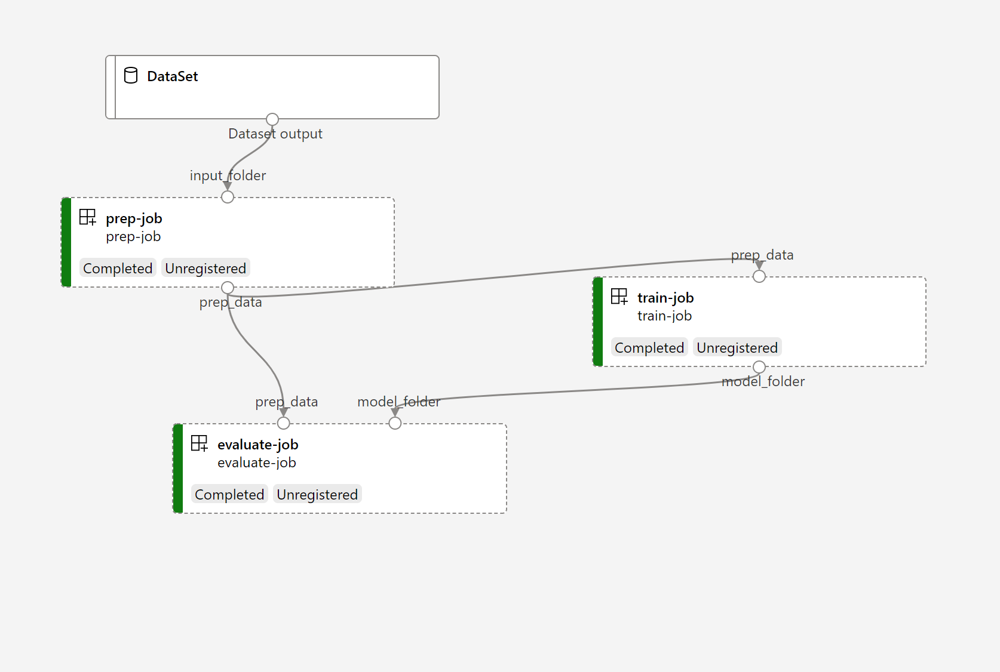

# Part 1: Structure code for fast iterative development

## Goal 
Your team has been working on a new ML problem. The team has been performing exploratory work on data and algorithm and has come to the state that the solution direction is solidified. Now, it is a time to put a structure into the work so that the team can iterate faster toward building a fully functional solution.   

So far, team members working mostly on Jupyter notebook on their personal compute (Azure CI & PC), as the first step in MLOps, you need to re-engineer the process so that the team can achieve the followings:  

- Modularization: restructure the notebook into python modules
- Parameterization: Adding parameters so that modules can be rerun with different parameters 

## Pre-requisites
- Complete the setup process to setup Azure ML workspace
- Run data setup to create local datasets for unit test as well remote full dataset

## Tasks
- Review the jupyter notebook that represent the work of a data scientist up to this point, make sure you can run the notebook and understand it. 
- Split the notebook into a feature/data engineering module, a ML training module and a model validation module 
- parameterize the module so that they can accept different input values at runtime
- Detailed instructions:
    - Create 3 seperate folders: data_engineering, evaluting, training 
    - Refactor the data engineering logic into a feature_engineering.py module under data_engineering folder. The module performs the followings:
        - Accept following parameters:
            - input_folder: path to a folder for input data
            - prep_data: path to a folder for output data
            - public_holiday_file_name: name of the public holiday file
            - weather_file_name: name of the weather raw file
            - nyc_file_name: name of the newyork taxi raw file
        - Perform data transformation, data merging and feature engineering logics 
        - Split the data into train and test sets where test_size is 20%
        - Write the output data files to output folder
    - Refactor the ML training logic into a ml_training.py module under training folder. The module performs the followings:
        - Accept following parameters:
            - prep_data: path to a folder for input data
            - input_file_name: name of the input train data file
            - model_folder: path to a output folder to save trained model
        - Split input train data into train and validation dataset, perform training  
        - print out MAPE, R2 and RMSE metrics
        - Write the train model file to output folder
    - Refactor the ML validation logic into a ml_evaluating.py module under evaluating folder. The module performs the followings:
        - Accept following parameters:
            - prep_data: path to a folder for test input data
            - input_file_name: name of the input test data file
            - model_folder: path to a model folder 
            - model_file_name: name of the input model_file
        - Load the model 
        - Score the model on input test data, print out MAPE, R2 and RMSE metrics

### The entire training pipeline is illustrated with this diagram

## Success criteria
- Feature engineering module:
    - The feature_engineering module can accept the unit test input files 
    - Data is processed correctly and output to a folder as final_df.parquet and test_df.parquet files and ready to be ML trained
- ML training module
    - Perform ML training and print out Accuracy, R2 and RMSE metrics from input unit test dataset
    - Produce the model at the output location
- ML evaluating module
    -  Perform ML training and print out Accuracy, R2 and RMSE metrics from an input dataset and model file
- Call the 3 modules in a sequence of feature_engineering -> ml_training -> ml_evaluating with next module uses output from the previous module

## Reference materials

